# TryHackMe - TakeOver Walkthrough

## **🎯 What is Subdomain Takeover?**

A vulnerability where an attacker can "claim" an unused subdomain that's still pointing to external services

### **Simple Analogy:**

Imagine you move out of a house, but the postal service still delivers mail there. Someone else can claim that address and receive your mail !

### 🔗 Room URL:  [https://tryhackme.com/room/takeover](https://tryhackme.com/room/takeover)

### **📍 Where This Room is From:**

- **Platform:** TryHackMe
- **Room Type:** Web Security / Reconnaissance
- **Description:** This challenge revolves around subdomain enumeration
- **Difficulty:** Beginner-Intermediate
- **Category:** Bug Bounty / CTF

## **📋 Prerequisites Needed**

### **Technical Basics:**

- Basic Linux command line knowledge
- Understanding of DNS (what domains/subdomains are)
- Web browser navigation

### **Tools You'll Use:**

- nano - text editor
- DNS tools
- Subdomain scanners (Gobuster)
- Web browser

### **Mindset:**

- Patience for reconnaissance
- Attention to detail
- Curiosity to explore

## 1. Starting The Machine:

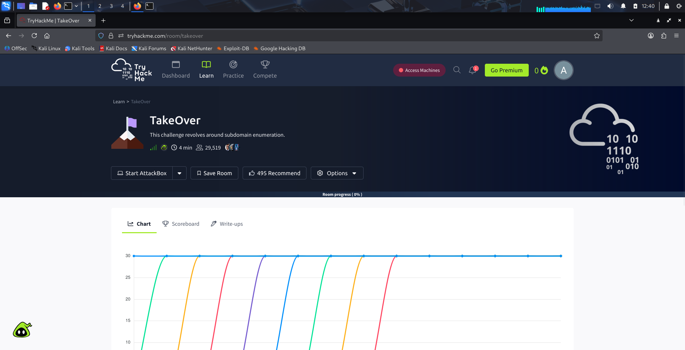

## 2. Getting the IP Address:

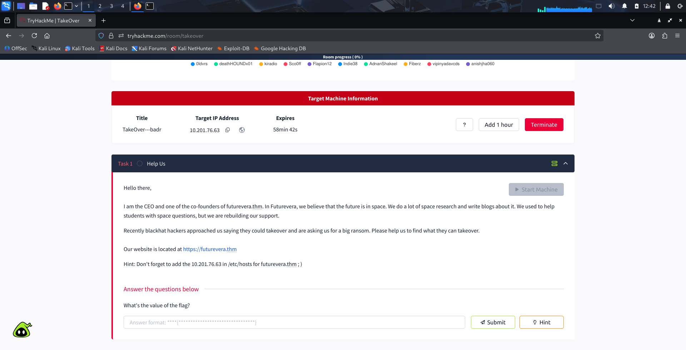

## 3. Downloading OpenVPN:

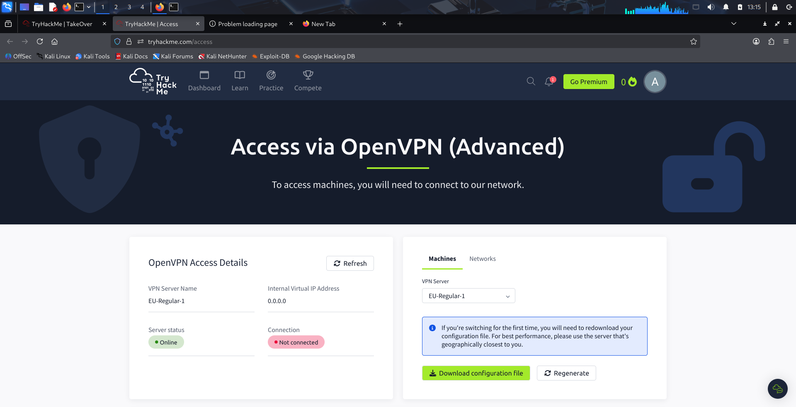

                            The vpn is automatically downloaded to local storage.

## 4. Setting Up VPN:

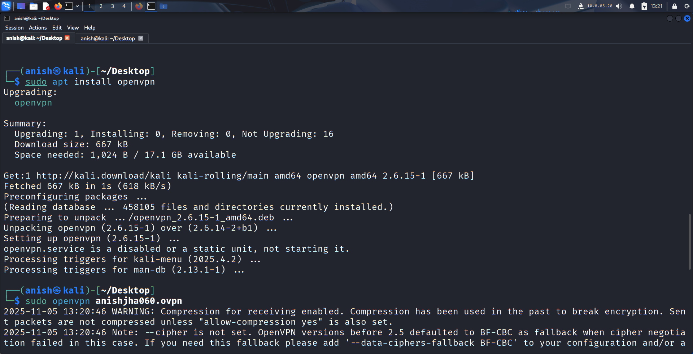

                                         sudo openvpn “previously downloaded file”

## 5. To Verify VPN Status:

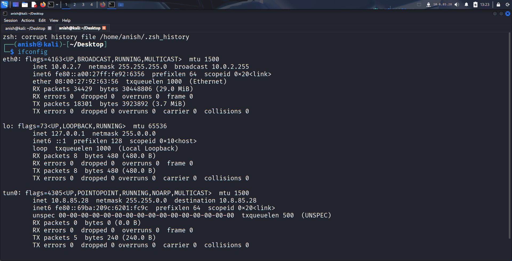

                                      tun0 - It verifies the vpn connection is established.

## 6. Adding IP & Domain On “nano”:

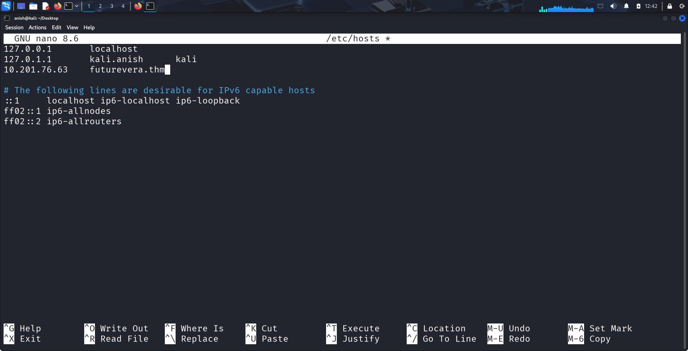

After the successful connection with open vpn, the ip & domain are then added to nano text editor using “sudo nano /etc/hosts” command. 

## 7. Verifying:

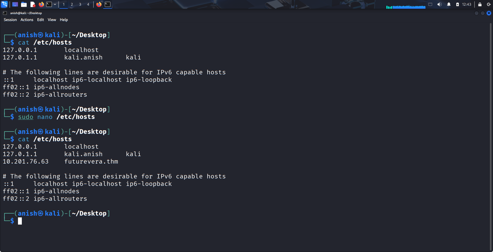

                                                   cat /etc/host - To view added ip

## 8. Loading Website:

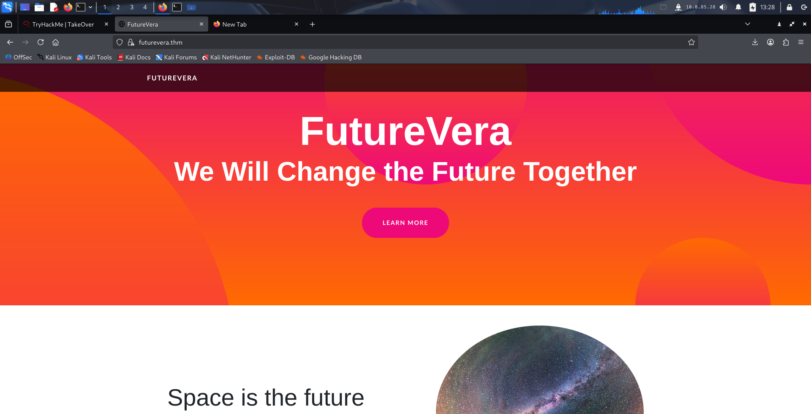

After the completion all those 7 steps, the website will successfully load. 

## 9. Gobuster Enumeration:

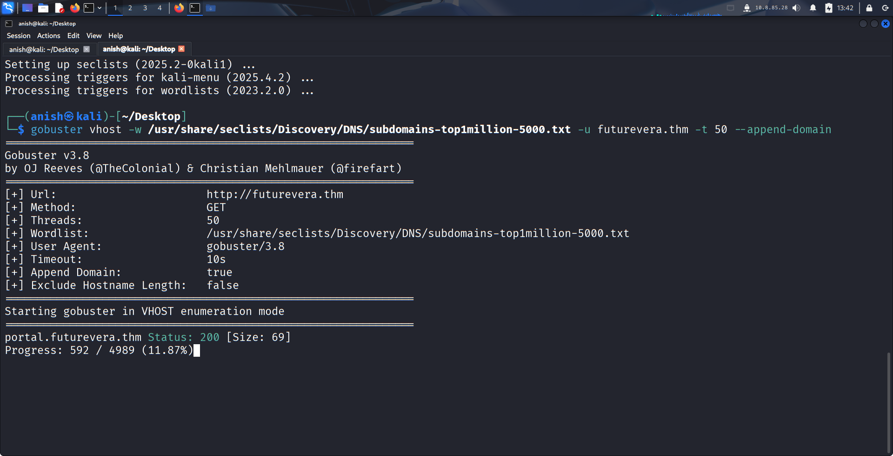

Gobuster is used to find the subdomain using command : 

gobuster vhost -w /usr/share/seclists/Discovery/DNS/subdomains-top1million-5000.txt -u futurevera.thm -t 50 --append-domain

## 10. Added “portal.futurevera.thm” on nano:

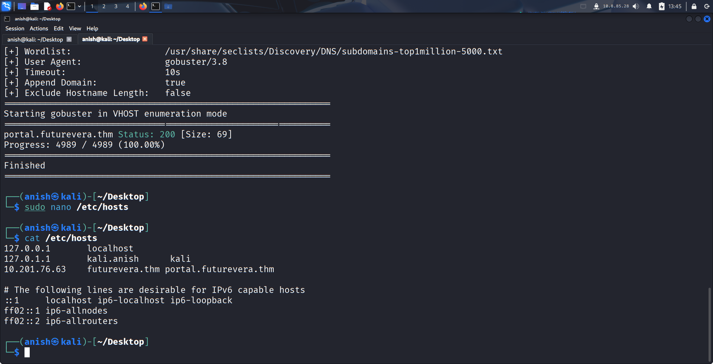

Again, adding the found subdomain to nano text editor.

## 11. Scanning Certificates:

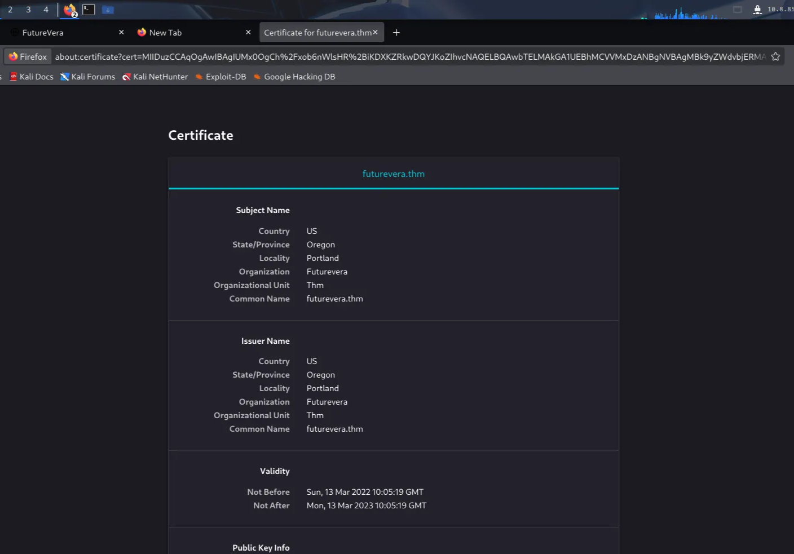

After loading “portal.futurevera.thm” we are looking at certificates to look up for any important clue or lead.

## 12. Found Blog & Support Sub-Domain:

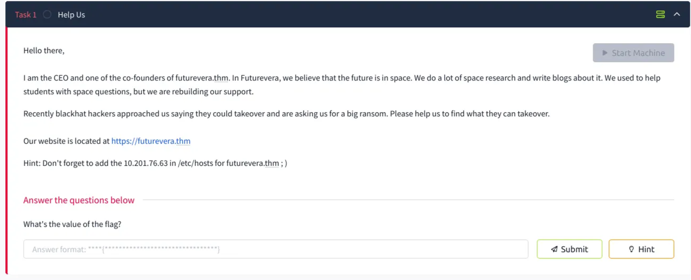

Since, blog and support both are mentioned on the initial text so we consider both as the clue for subdomain enumeration.

## 13. Adding Blog & Support on nano:

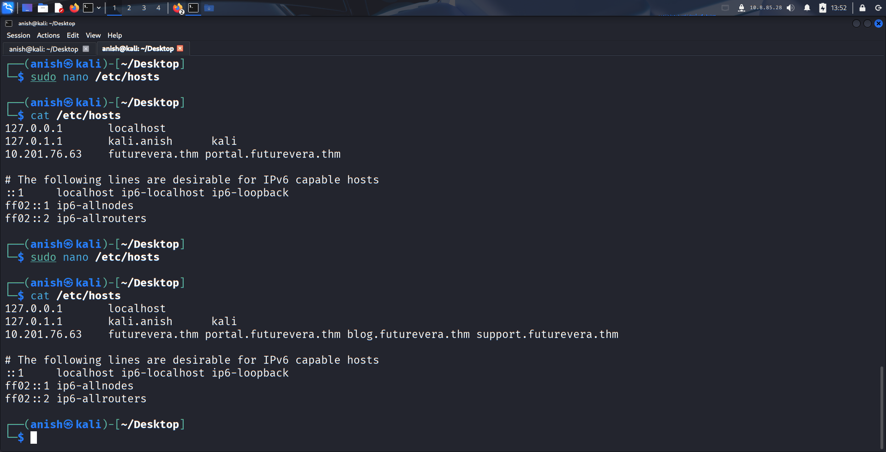

## 14. Opened “blog.futurevera.thm”:

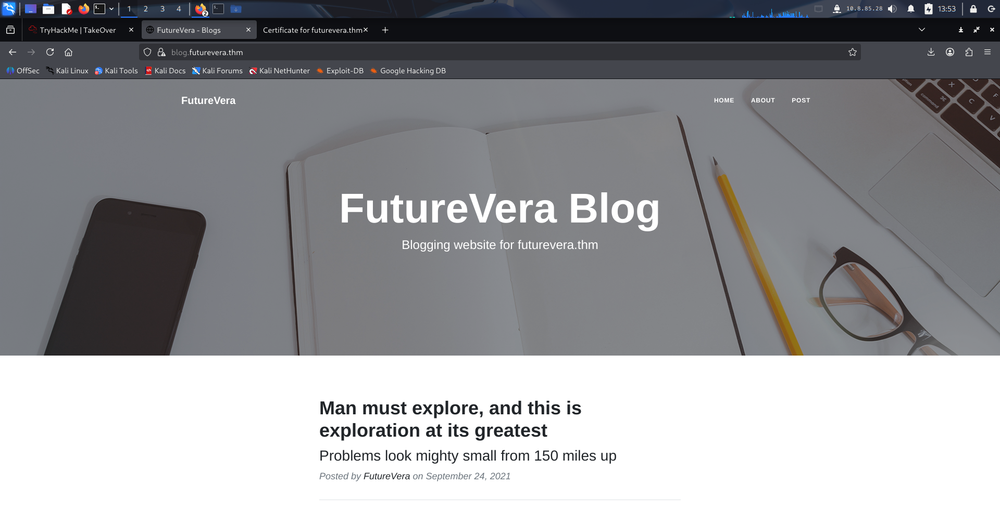

We check out the “blog.futurevera.thm” website and its certificates but couldn’t find any leads.

## 15. Opened “support.futurevera.thm”:

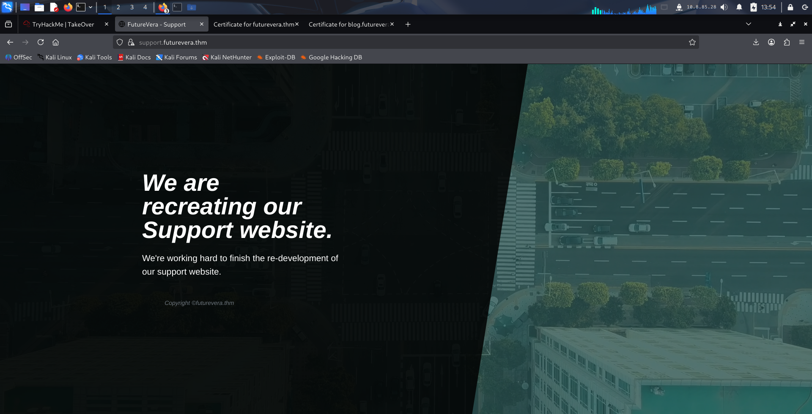

## 16. Found Secret Sub-Domain:

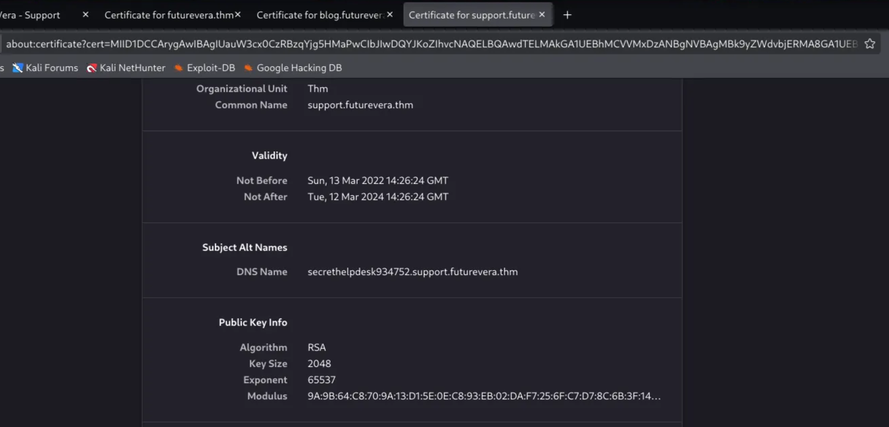

We check out certificates of “support.futurevera.thm” and found out the secret DNS. 

## 17. Loading “secrethelpdesk934752.support.futurevera.thm”:

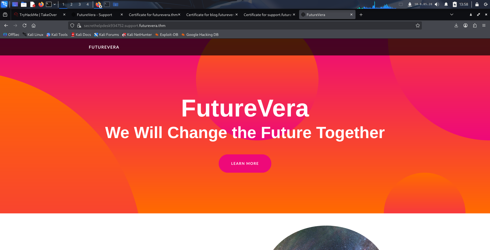

Loading the secret DNS as https.

## 18. Found flag:

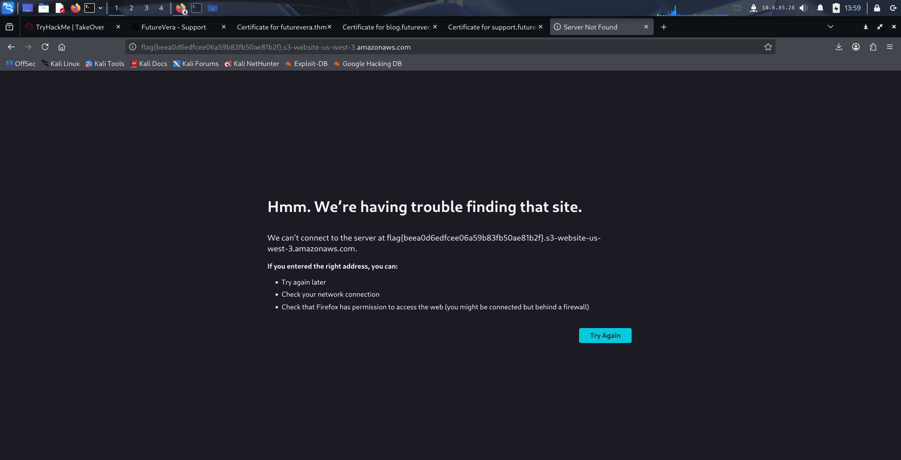

Loading the secret subdomain as http and voila found out the flag.

## 19. Checking flag:

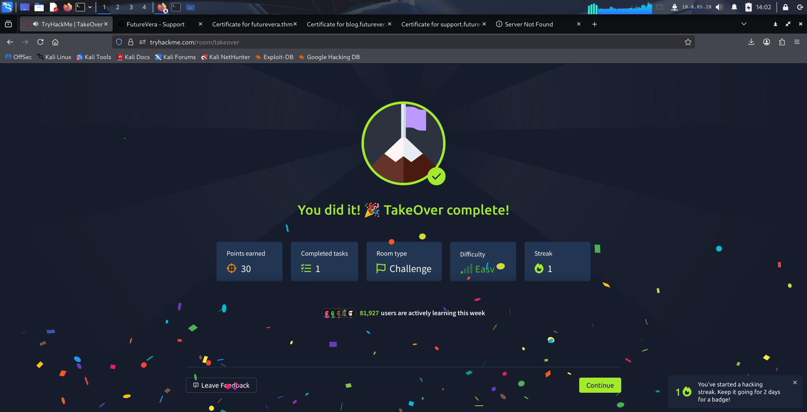

### Finally, the flag is found and hence, TakeOver is completed.

## Conclusion:

This type of vulnerability really shows that security isn't just about strong passwords and firewalls - it's also about cleaning up after yourself and keeping track of all your digital assets. Even small oversights can have big consequences !

- How easy it is to find these vulnerabilities with the right tools
- The importance of thorough reconnaissance
- That companies often forget about old subdomains they once used
- One simple check could prevent this entire security risk

Great room for understanding real-world web security !  🚀
